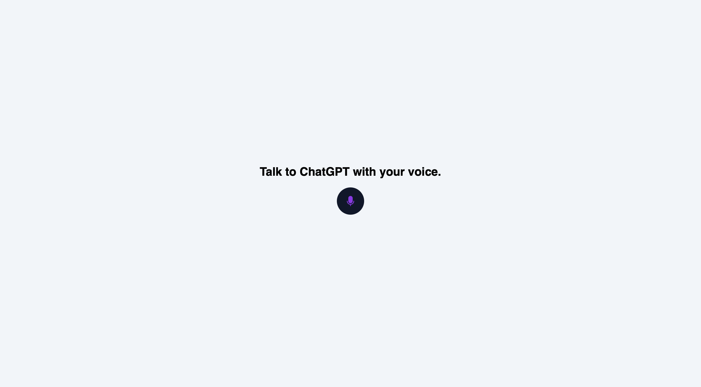

# Talk To ChatGPT

This is a simple web app that allows you to talk to a chatbot powered by [ChatGPT](https://chat.openai.com/). 
It is built using [React](https://reactjs.org/) and [TailwindCSS](https://tailwindcss.com/).

I'm using `react-speech-recognition` to get the speech input and `SpeechSynthesisUtterance` to convert the text to speech.

## Demo


## Getting Started
Clone the repository and install the dependencies.

```bash
git clone
cd talk-to-chatGPT
npm install
```

## Running the app
To run the app, run the following command.

```bash
npm start
```


